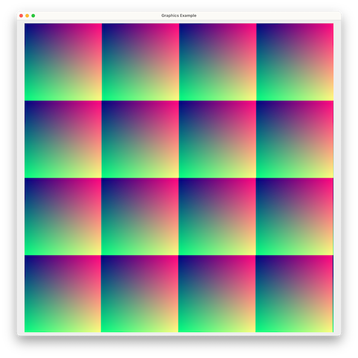
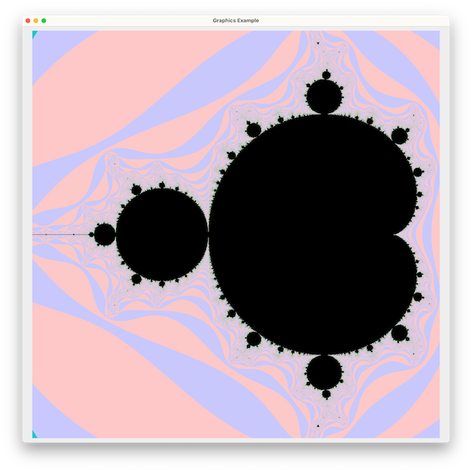

# 導入：オブジェクトとクラス

1. 導入 - [`phones.scala`](src/phones.scala)

1. クラス定義 - [`complex1.scala`](src/complex1.scala)

1. クラス定義（`val` と `def`） - [`complex2.scala`](src/complex2.scala)

1. オブジェクト表現が与えるメモリシステムへの影響 - [`memory.scala`](src/memory.scala)

1. `class Complex` の応用例：グラフィックス - [`graphics.scala`](src/graphics.scala)

     

# 文字化けについての注意事項

Windows でこの sbt プロジェクトを使う場合は、日本語出力が文字化けすることがあります。その場合は、`project/programming1.scala` の以下の行を削除してから、sbt を再起動してみて下さい。

~~~
      run / fork          := true,
      run / connectInput  := true,
~~~
